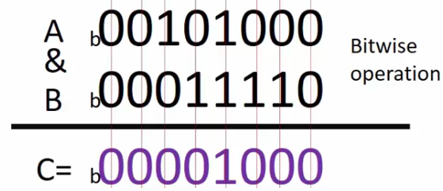
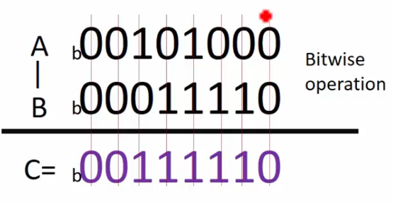
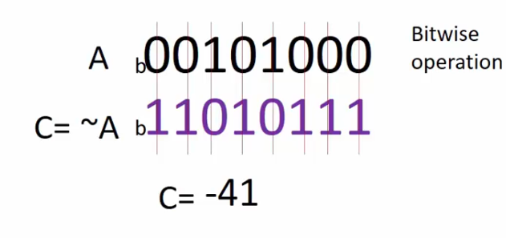
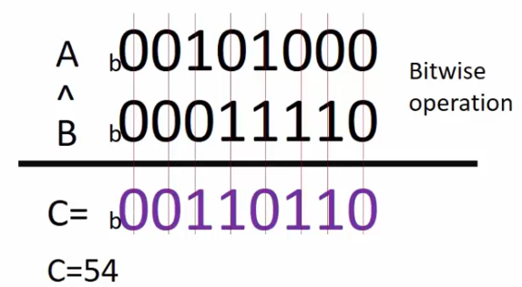

# Bitwise Operators in 'C'
- & (bitwise AND)
- | (bitwise OR)
- << (bitwise left shift)
- >> (bitwise right shift)
- ~ (bitwise NOT) (negation)
- ^ (bitwise XOR)

## Bitwise AND
We make AND operation on each bit of the two numbers.
```c
char A = 40;
char B = 30;
C = A & B;
```
  

**Результат:** `C = 8`

## Bitwise OR
We make OR operation on each bit of the two numbers.
```c
char A = 40;
char B = 30;
C = A | B;
```
  

**Результат:** `C = 62`

## Bitwise NOT
We make NOT operation on each bit of the number (inverts all bits).
```c
char A = 40;
C = ~A;
```


## Bitwise XOR
We make XOR operation on each bit of the two numbers.
```c
char A = 40;
char B = 30;
C = A ^ B;
```
**Truth table for XOR operation:**
A | B | A^B
--- | --- | ---
0 | 0 | 0
0 | 1 | 1
1 | 0 | 1
1 | 1 | 0

1 повертається тільки коли один з операндів 1, а інший 0.  


# Applicability of bitwise operations
In an Embedded C program, most of the time you will be doing:
- Testing of bits (&)
- Setting of bits (|)
- Clearing of bits (& and ~)
- Toggling of bits(^)

Наприклад при керуванні LED на мікроконтролері можна використовувати setting of bits для включення і clearing of bits для вимикання.