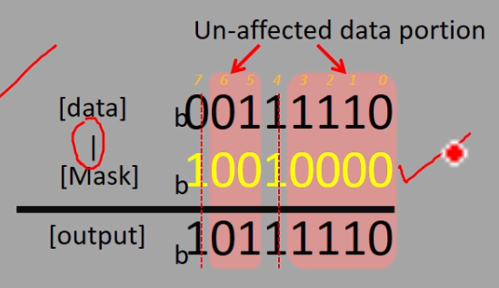

# Exercise: Setting of bits
Write a program to set(make bit state to 1) 4th and 7th bit position of a given number and print the result.

## solution
We use the OR operator to set the bits.  


```c
#include <stdio.h>
#include <stdint.h>

int main(void) {
    int32_t num1, output;
    printf("Enter a number: ");
    scanf("%d", &num1);

    output = num1 | 0x90;
    printf("[input] [output]: 0x%x 0x%x\n", num1, output);

    return 0;
}