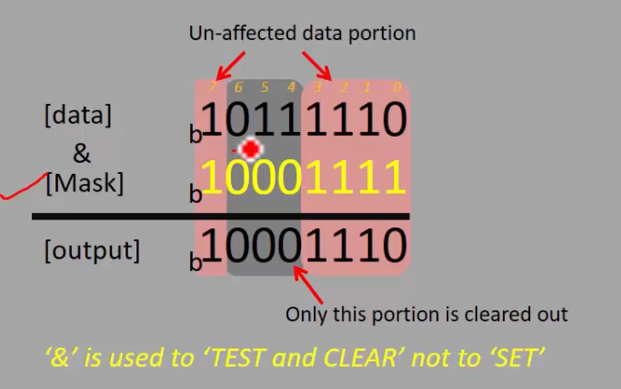
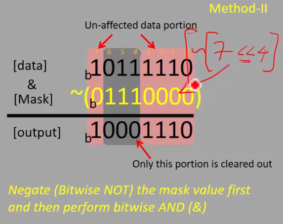

# Exercise: Clearing of bits
Write a program to clear(make bit state to 0) 4th, 5th, 6th bit positions of a given number and print teh result.

## Solution using bitwise AND
Для Clear використовується bitwise AND з маскою, в якій всі біти, які ми хочемо очистити, встановлені в 0, а всі інші біти встановлені в 1.  

## Solution using bitwise AND together with bitwise NOT and bitwise shift left
  
Це по суті те ж саме, але з невеликим шорткатом.
0111000 можна отримати за допомогою операції `7 << 4` (4, 5, 6 біти), Потім ми цей результат інвертуємо за допомогою bitwise NOT, щоб отримати маску 1000111.  
