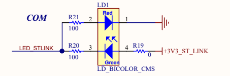
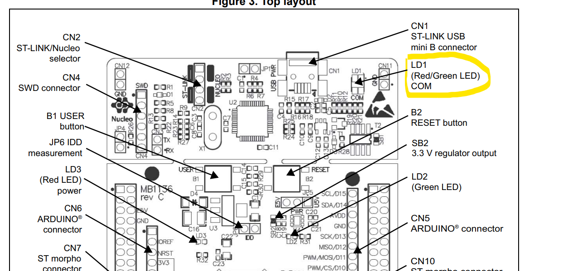
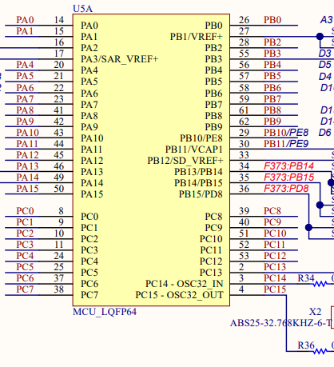

# Exercise
Write a program to turn on the LED of your target board
For this exercise we need the knowledge of
 - Pointers
 - Bitwise operations
 - Hardware connections

# Hardware connections
Lets understand how external hardware (LED) is connected to MCU
- Refer schematic of the board you are using on the ST website.  
  
https://www.st.com/en/evaluation-tools/nucleo-f446re.html#cad-resources. Вкладка "Schematic Pack"

Пошуком по документу можна знайти `LED`

https://www.st.com/en/evaluation-tools/nucleo-f446re.html#documentation  
У вкладці "User Manuals" можна знайти документацію по платі. Там є схема плати. Тут вказано де знаходяться LED на платі.
  

В мікроконтролерах NUCLEO-XXXXRX є 3 групи (ports) пінів(по 16 штук) до яких можна підключати зовнішню периферію. Ці групи це PORT-A(піни PA), PORT-B(піни PB), PORT-C(піни PC).

