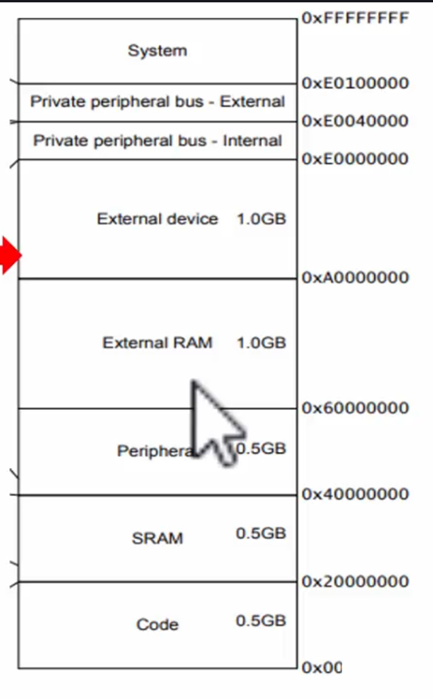

# What are processor addressable memory locations? 
.png>)  
Спілкування між різними частинами мікроконтролера відбувається через шину даних(system bus(AHB))  
32 bit address channel означає, що на цій шині можна передавати дані в $2^{32} = 4,294,967,295$ різних місць (addressable memory locations).  
За допомогою процесора ми беремо дані з "Data memory" і записуємо в один з реєстрів "GPIOD", щоб керувати пінами.

Program memory, data memory, registers of various peripherals are organized within the same linear 4 G byte of address space.  
This is a generic memory map which must be followed by all MCUs which use ARM cortex Mx processor. Тут показується, з якої по яку адресу пам'яті шини займають різні пам'яті.
  

Адреси порта "GPIO D" це частина від усіх адрес "Peripheral"