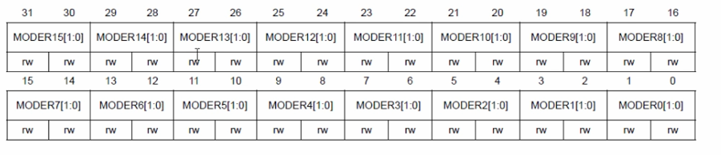

# Calculating peripheral register addresses
## Address of the Clock control register (AHB1ENR)
Base address for RCC peripheral is 0x4002 3800. Offset for AHB1 peripheral clock enable register is 0x30. We add those two values and get the address of the AHB1ENR register.  
`0x4002 3800 + 0x30 = 0x4002 3830`

## Address of the GPIOD mode register(used to control mode of the pin)
Base address for GPIO D peripheral is `0x4002 0C00`.  
To get offset we go to **"General-purpose I/Os > GPIO registers > GIPIO port mode register (GPIOx_MODER) (x=A...I/J/K)"** section in the reference manual.
Тут ми знаходимо offset для реєстру, що контролює режими (modes) пінів певного порту. Для порту D (як і для всіх інших) цей offset = 0x00.  
  
Тут є 32 біти. Вони парами відповідають за режими різних пінів. Наприклад, біти 24 і 25 відповідають за перемикання режиму піна 12 (наш LED). Два біти використовуються, бо пін може бути в 4 режимах (00, 01, 10, 11).   
- **00** - input (reset state)
- **01** - general purpose output mode
- **10** - alternate function mode
- **11** - analog mode  
Для контролю LED необхідно перевести пін в режим **01**.  

Тепер ми знаходимо адресу реєстру GPIOD_MODER, додаючи початкову адресу порту D і offset реєстру.  
`0x4002 0C00 + 0x00 = 0x4002 0C00`

## Address of the GPIOD output data register (used to write)
В мануалі переходимо сюди: **General-purpose I/Os > GPIO registers > GPIO port output data register (GPIOx_ODR)(x = A...I/J/K)**. Це також 32-бітний регістр. Біти з 0 по 15 контролюють стани пінів, його offset - `0x14`. В ці біти ми записуємо значення, яке ми хочемо виставити на піні (HIGH або LOW). Щоб подати HIGH на LED піна 12, потрібно записати 1 в 12-й біт.  
Адреса **output data register**:  
`0x4002 0C00 + 0x14 = 0x4002 0C14` (Базова адреса GPIOD + offset реєстру)

## Адреси, які ми знайшли:
- **AHB1ENR** - 0x4002 3830 (RCC, clock control register)
- **GPIOD_MODER** - 0x4002 0C00 (GPIOD, mode register)
- **GPIOD_ODR** - 0x4002 0C14 (GPIOD, output data register)