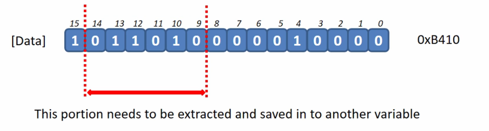

# Bit extraction
Lets consider this problem statement:

Extract bit position from 9th to 14th [14:9] in a given data and save it in to another variable.
   
This can be done using this method:
1) Shift the identified portion to right hand side until it touches the least significant bit (0th bit)
.png>)  
2) Mask the value to extract only 6 bits [5:0] and then save it in to another variable.
.png>)  

```c
uint16_t Data = 0xB410;
uint8_t output;
output = (Data >> 9) & 0x3F;
```

