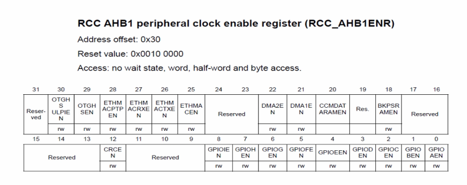

Це покращення коду для [цього прикладу](../../Section%2020.%20Looping/136.%20LED%20toggle%20using%20software%20delay/summary.md)

Щоб зробити абстракцію для коду, ми можемо використовувати комбінацію структур з бітовими полями та unions.  
Ми можемо робити ці unions для кожного з регістрів, які ми будемо використовувати.  

## Приклад регістру
  

Всі ці структури краще зберігати в окремому файлі, наприклад `gpio.h`.

```c
#ifndef MAIN_H_
#define MAIN_H_

typedef struct {
    uint32_t gpioa_en :1;
    uint32_t gpiob_en :1;
    uint32_t gpioc_en :1;
    uint32_t gpiod_en :1;
    uint32_t gpioe_en :1;
    uint32_t gpiof_en :1;
    uint32_t gpiog_en :1;
    uint32_t gpioh_en :1;
    uint32_t gpioi_en :1;
    uint32_t reserved :3;
    // і так далі
} RCC_AHB1ENR_;

#endif
```

Файл `main.c`:
```c
#include "main.h"


```