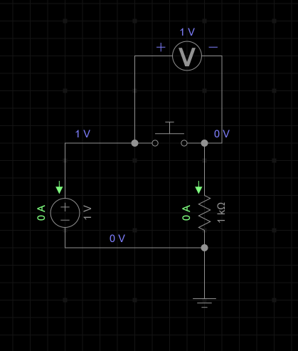

.png>)  

Тут видно, що column $C_1$ наразі в режимі **floating** і зчитування з нього вразливе до електромагнітних перешкод. Щоб цього уникнути, ми використовуємо внутрішній pull-up резистор. Тобто за замовчуванням PD8 зчитує HIGH. При замиканні контакту, PD8 зчитує LOW напругу із кнопки. Для цього ми маємо зробити так, щоб PD0, був підключений до GND і на рядку $R_1$ був LOW. Таким чином PD8 (вольтметр, що теж підключений до GND) зчитує LOW.  
.png>)  

  

Ось цей резистор - це pull-up резистор. Він потрібен для того, щоб при натисканні кнопки не було короткого замикання між VDD і піном PD0, який підключений до GND. Коли кнопка не натиснута, вольтметр(пін PD8) зчитує напругу на самому собі (HIGH), оскільки на нього падає вся напруга через великий внутрішній опір.