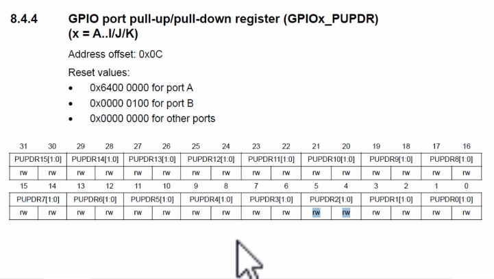

[Flowchart](./keypad_flow_chart.pdf)

# Program implementation

### Step 1
- Find out the free IOs available on your target board pin headers
- Decide which are the IO pins you are going to use to handle rows and columns of the keypad.

### Step 2
- Create required pointer variables to handle memory-mapped registers
- Initialize the pointer variables with appropriate memory-mapped register addresses
- Make use of type qualifiers such as `volatile` if memory-mapped register access is involved.

### Step 3
- Initialization
  - Make all row IOs mode as OUTPUT
  - Make all column IOs mode as INPUT
  - Activate internal pull-up resistors for all column IOs(Refer to the pull-up/pull-down enable register)  
  Go to **GPIO registers > GPIO port pull-up/pull-down register(GPIOx PUPDR) (x=A...I/J/K)**. 
    
  Кожні два біти відповідають за один пін. В залежності від значень цих бітів, ми активуємо три різні режими:  
  00: no pull-up, pull-down  
  01: pull-up  
  10: pull-down  
  11: reserved  

### Step 4
- Implement the key detect logic as per the flowchart