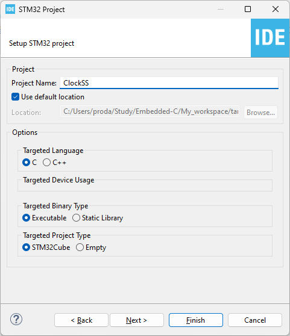
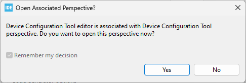

В STM32CubeIDE можна переглядати налаштування осциляторів у мікроконтролері.

Для цього при створенні проєкта STM32, у секції "Targeted Project Type" обираємо **STM32Cube**   
  

тут натискаємо "Yes":  
  

Після цього у вкладці **Clock Configuration** можна переглядати налаштування осциляторів.

До **HSE** підключаються зовнішні кварцові резонатори, які генерують тактову частоту.  
Плати DISCOVERY зазвичай мають зовнішні кварцові резонатори на самій платі. Плати NUCLEO не мають зовнішніх кварцових резонаторів на платі, але як джерело HSE вони можуть використовувати ST-LINK (**ST-LINK** — це програматор і відладчик від STMicroelectronics для мікроконтролерів STM32. Він дозволяє:
✔ Заливати (флешити) код у мікроконтролер.
✔ Відлагоджувати програму (дивитися змінні, ставити точки зупину).
✔ Спілкуватися з мікроконтролером через SWD або JTAG.).  

Але також у NUCLEO є можливість підключити (припаяти) зовнішній кварцовий резонатор до HSE (X3 на діаграмі).