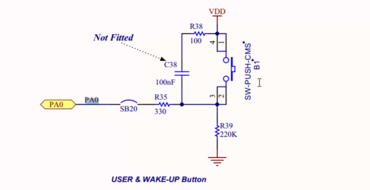

На платі DISCOVERY є кнопка. Можна відловлювати її натискання за допомогою interrupts.

  
Коли кнопка не натиснута, пін **PA0** зчитує сигнал LOW із GND. При натисканні кнопки, весь струм тече через резистор R39, і пін **PA0** зчитує HIGH на цьому резисторі. Пін паралельно увімкнений паралельно з цим резистором.

## How we have to understand How GPIO pin interrupts the processor? What is the design?
How the vendor delivers the GPIO interrupt signal to the processor?

Всі interrupts відбуваються через модуль **EXTI**.  
**EXTI(External interrupt/event controller)** - це модуль, який відповідає за обробку зовнішніх переривань. Він дозволяє мікроконтролеру реагувати на події, які відбуваються на зовнішніх пінах. Some peripherals deliver their interrupt to the NVIC over the EXTI line. Some peripherals deliver their interrupt directly to the NVIC.
**EXTI** підключений до шини **APB2**.  
Переривання відбуваються за допомогою **handlers**, про які йшлося [тут](../../Section%2011.%20Understanding%20MCU%20Vector%20table/42.%20Understanding%20MCU%20Vector%20Table/summary.md). Всього є 23 обробники переривань, тобто 23 функції, які можна перевизначити в коді і вони будуть викликатись при виникненні переривання.