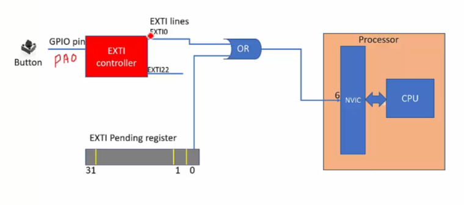

## Реєстри EXTI
### Interrupt mask register (EXTI_IMR)
Щоб активувати одну з ліній EXTI (EXTI0, EXTI1, EXTI2...) потрібно налаштувати регістр **EXTI_IMR**. Тут є 23 біти (по одному на кожну лінію EXTI), які потрібно активувати. Якщо біт дорівнює 1, то лінія EXTI активна.
### Rising trigger selection register (EXTI_RTSR)
Тут також 23 біти, які налаштовують, чи повинні викликатися переривання, якщо сигнал переходить з LOW в HIGH (**rising**). Якщо біт дорівнює 1, то переривання буде викликане.
### Falling trigger selection register (EXTI_FTSR)
Тут також 23 біти, які налаштовують, чи повинні викликатися переривання, якщо сигнал переходить з HIGH в LOW (**falling**). Якщо біт дорівнює 1, то переривання буде викликане.
### Pending register (EXTI_PR)
В біти цього регістру записуються значення 1, якщо переривання відбулося.
   
Наприклад, на рисунку відбувається тригер на піні **PA0**. EXTI0 стає HIGH. Якщо нульовий біт в регістрі **EXTI_PR** активний, через нього також іде сигнал HIGH. Ці сигнали зливаються в OR і передають сигнал далі на NVIC. Коли сигнал на кнопці пропадає, EXTI0 стає LOW. Але все ще OR даватиме HIGH, бо біт в **EXTI_PR** активний. Цей біт не очищається сам по собі, його потрібно очищати в коді. Щоб очистити біт, потрібно записати 1 в цей біт(**[Write 1 to Clear](Write%201%20to%20Clear.md)**)


## Код button interrupt
```c
#include <stdint.h>

volatile uint8_t g_button_pressed = 0;
uint32_t g_button_press_count = 0;

void button_init(void);

uint32_t volatile *pEXTIPendReg     = (uint32_t *)(0x40013C00 + 0x14);
uint32_t volatile *pClkCtrlReg      = (uint32_t *)(0x40023800 + 0x30);
uint32_t volatile *pClkCtrlRegApb2   = (uint32_t *)(0x40023800 + 0x44);
uint32_t volatile *pGPIOModeReg     = (uint32_t *)(0x40020000 + 0x00);
uint32_t volatile *pEXTIMaskreg     = (uint32_t *)(0x40013C00 + 0x00);
uint32_t volatile *pEXTIEdgeCtrlReg = (uint32_t *)(0x40013C00 + 0x08);
uint32_t volatile *pNVICIRQEnReg    = (uint32_t *)(0xE000E100 + 0x00);

int main(void) {
    button_init();

    while (1) {
        // Disable EXTI0 interrupt
        &pEXTIMaskReg &= ~(1 << 0);

        if (g_button_pressed) {
            // Some delay until button debouncing gets over
            for (uint32_t volatile i=0; i < 500000/2; i++);
            g_button_press_count++;
            printf("Button pressed %d times\n", g_button_press_count);
            g_button_pressed = 0;
        }
        // Enable EXTI0 interrupt
        *pEXTIMaskReg |= (1 << 0);
    }
}

void button_init(void) {
    /* GPIOA clock enable */
    *pClkCtrlReg |= (1 << 0);

    /* syscfg clock enable */
    // EXTI підключено до шини APB2
    // Тут ми активуємо clock для EXTI на шині APB2
    *pClkCtrlRegApb2 |= (1 << 14); 

    /* Edge detection configuration */
    *pEXTIEdgeCtrlReg |= (1 << 0); // Rising edge trigger

    /* EXTI interrupt enable */
    *pEXTIMaskReg |= (1 << 0); // Enable EXTI0
}

/* This is button interrupt handler */
/* Тут перевизначається interrupt функція. Її назва повинна бути такою ж, як в таблиці векторів переривань. */
void EXTI0_IRQHandler(void) {
    // Make this flag SET if button is pressed
    g_button_pressed = 1;

    // Clearing of EXTI interrupt pending bit
    // Ми сигналізуємо, що переривання оброблено, щоб воно не викликалося знову і знову.
    *pEXTIPendReg |= (1 << 0);
}

```