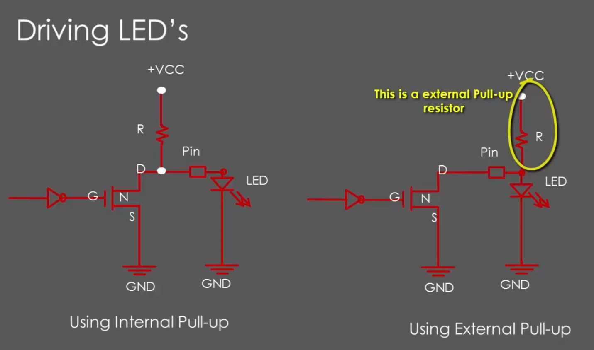

# GPIO output mode with open drain state
Це працює для пінів в режимі OUTPUT.  
  
Початок піна зліва, ми подаємо HIGH або LOW на інвертор (він інвертує HIGH в LOW і навпаки) зліва.
В режимі **open drain**, при подачі LOW на транзистор, струм іде від VSS через pull-up резистор до LED. Через транзистор струм не тече.  
При подачі HIGH на транзистор, через нього починає текти струм від VCC до через pull-up резистор до GND. Струм не доходить до LED, бо він іде в обхід до GND через транзистор, бо там набагато менший опір ніж в LED.