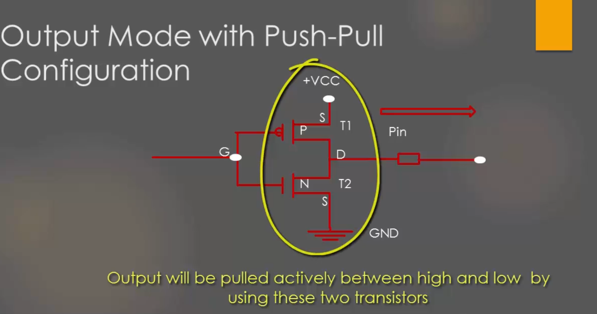
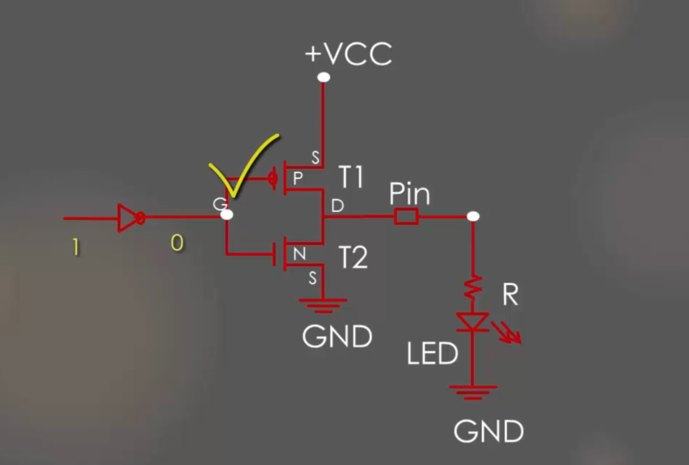

# GPIO output mode with push pull state
Це працює для пінів в режимі OUTPUT.    
   
В такій конфігурації для роботи не потрібно ні pull-up, ні pull-down резисторів.  
Тут в залежності від сигналу зліва(сигнал піна), активується один з транзисторів. При активації верхнього, пін видає на виході (справа) HIGH. При активації нижнього - LOW.  
  
Ось так можна активувати LED. Тут все ясно.