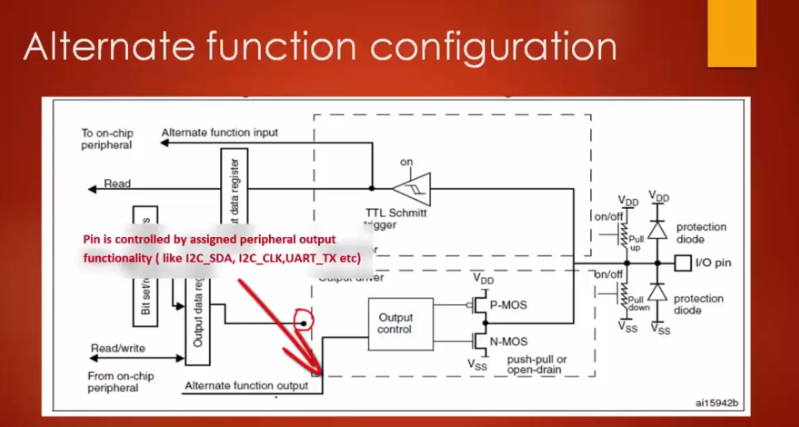

Окрім режимів **input/output** піни ще підтримують режим **alternate function**. В цьому режимі пін може виконувати функцію, яка не є стандартною для GPIO. В цьому режимі пін може виконувати функцію іншого модуля, наприклад UART-TX, UART-RX, timers input channel, ADC input channel, serial clock of the SPI peripheral, data line of the I2C peripheral, etc.  
