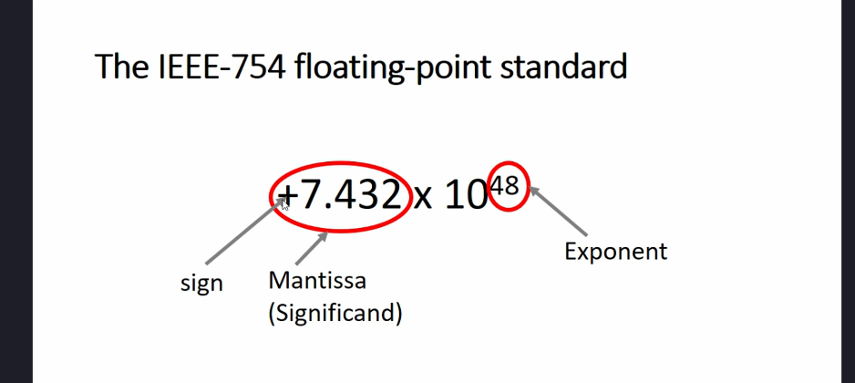

# The IEEE-754 floating-point standard

В такому форматі числа зберігаються скороченими.

## Скільки бітів використовується для зберігання числа?
### Single precision (`float`)
Використовується 32 біти (4 байти) для зберігання числа. Це включає 1 біт для знака, 8 бітів для експоненти та 23 біти для мантиси (significand).
.png>)

### Double precision (`double`)
Використовується 64 біти (8 байт) для зберігання числа. Це включає 1 біт для знака, 11 бітів для експоненти та 52 біти для мантиси.

## Format specifier for float and double data types
- Use `%lf` for `double` data type
- Use `%f` for `float` data type
- Use `%e` for `float` and `%le`double` data types to display in scientific notation
- All constants with a decimal point are treated as `double` by default. To treat them as `float`, append `f` or `F` at the end of the constant.