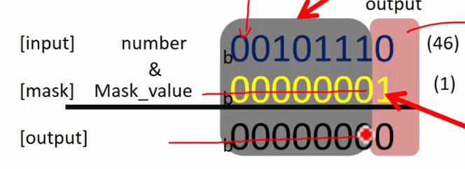

# Exercise
- write a program to find out whether a use entered integer is even or odd.
- print an appropriate message on the console.
- Use testing of bits logic
  
Всі числа, в яких в бінарній формі останній біт (least significant bit) 1, є непарними числами. Числа, в яких в бінарній формі останній біт (least significant bit) 0, є парними числами.  
46 (0x2E)  
00101110 - парне число

47 (0x2F)
00101111 - непарне число

## Solution
Ми використовуємо маску 00000001 (1). Ми робимо побітове AND з числом і маскою і якщо результат нуль, то число парне, інакше непарне. Маска робить всі інші біти нулями, крім останнього біту.  Таким чином, ми тестуємо останній біт числа 46.
  
```c
if (number & 1) {
    printf("Number is odd\n");
} else {
    printf("Number is even\n");
}
```