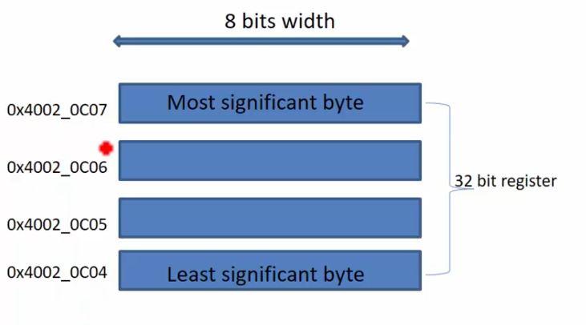

# About peripheral registers
- All peripheral registers in STM32 microcontroller are of 32 bits wide
- Different peripherals have different number of peripheral registers.
- You should never assume about the address of the peripheral registers. Always you should refer to the device reference manual.

# GPIOD Peripheral registers
Each register is of 32 bits wide.
1. **GPIOD port mode register**. Whether the pin is input or output
2. **GPIOD port output type register**.
3. **GPIOD port output speed register**.
4. **GPIOD port pull-up/pull-down register**. Activate or deactivate the internal pull-up or pull-down resistors.
5. **GPIOD port input data register**. Used to read the input data from the pin.
6. **GPIOD port output data register**. Write data to the pin.
7. **GPIOD port bit set/reset register**.
8. **GPIOD port configuration lock register**.
9. **GPIOD alternate function low register**.
10. **GPIOD alternate function high register**.

# GPIO port OUTPUT TYPE register

# How to control the state of the GPIOD pin?
**You must use GPIOD Output data register** to send the data to the pin.
.png>)  
First register bit 0 controls the state of the PD0 pin.
Second register bit 1 controls the state of the PD1 pin.
And so on until the 15th bit.