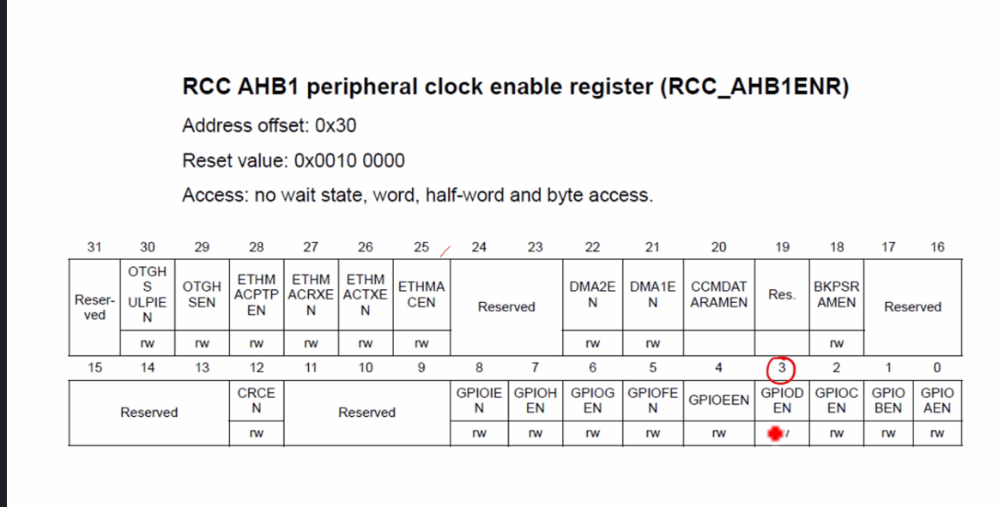

# How to Enable the peripheral clock?
1. We enable clock through **[peripheral clock control registers]** of the microcontroller
2. In STM32 MCU, all clock control registers are mapped at the below address range in the memory map of the Microcontroller.
   0x4002 3800 - 0x4002 3BFF | RCC (Reset and Clock Control) registers
   --- | ---

   This RCC engine takes care of controlling clocks for various parts of the microcontroller, such as processor, different peripherals, different buses, memories, etc.

To enable the clock for a peripheral, we need to write to the RCC register. ALL GPIO registers are actually hanging on the AHB1 bus:  
.png>)  
**Tip:** Щоб подивиться, яким чином ті чи інші компоненти з'єднані між собою, можна скористатися datasheet для мікроконтролера.  
## Активація clock для шини AHB1
В datasheet для **RCC AHB1 peripheral clock register** є дані про **adress offset**. Потрібно взяти початкову адресу RCC (0x4002 3800) і додати **adress offset**, таким чином ми отримаємо адресу реєстру, який відповідає за активацію clock для шини AHB1. В цьому реєстрі є 32 біта, кожен біт відповідає за активацію clock для певного периферійного пристрою.  

Для порту GPIOD це **bit 3 (GPIOD)**. Щоб активувати clock для порту GPIOD, потрібно записати 1 в **bit 3** реєстру **RCC AHB1 peripheral clock register**.