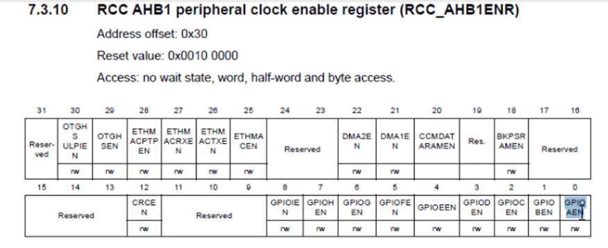

Для використання піна PA0, необхідно спочатку активувати для нього Clock. PA0 це частина GPIOA peripheral, для нього ми й маємо увімкнути clock. Так само, як і GPIOD, GPIOA підключено до шини AHB1, для якої ми й активуємо clock. Але необхідно використовувати інший біт реєстру RCC, а саме 0-й біт.  
  

Далі необхідно знайти адресу реєстру GPIOA, який відповідає за режими пінів **General-purpose I/Os > GPIO registers > GPIO port mode register (GPIOx_MODER)(x=A...I/J/K)**. Його початкова адреса 0x4002 0000, offset для mode register 0x00. Таким чином, адреса реєстру mode register GPIOA буде 0x4002 0000 (`pPortAModeReg`).

Далі ми маємо перейти до реєстру вводу GPIO **General-purpose I/Os (GPIO) > GPIO registers > GPIO port input data register (GPIOx_IDR)(x=A...I/J/K)**. Його початкова адреса 0x4002 0000, offset для input data register 0x10 (для будь якого gpio). Таким чином, адреса реєстру input data register GPIOA буде 0x4002 0010 (`pPortAInReg`).
Значення цих регістрів read-only. Тобто в них не можна записувати значення за допомогою коду. Вони містять лише значення напруги на пінах(HIGH або LOW). тобто, якщо підключити пін PA0 до VDD, то в реєстрі буде 1, якщо до GND, то 0.


```c
#include <stdint.h>

int main(void) {
    uint32_t *pClkCtrlReg = (uint32_t *)0x40023830; // RCC, clock control register
    uint32_t *pPortDModeReg = (uint32_t *)0x40020C00;
    uint32_t *pPortDOutReg = (uint32_t *)0x40020C14;

    uint32_t *pPortAModeReg = (uint32_t *)0x40020000;
    uint32_t *pPortAInReg = (uint32_t *)0x40020010;

    // 1. Enable the clock for GPIOD and GPIOA peripherals
    *pClkCtrlReg |= (1 << 3); // GPIOD
    *pClkCtrlReg |= (1 << 0); // GPIOA
    
    // 2. Configure the mode of the PD12 pin as output
    *pClkCtrlReg &= ~(3 << 24);  // clear 24 and 25
    *pClkCtrlReg |= (1 << 24); // set 24th bit to 1

    // 3. Configure the mode of the PA0 pin as input (GPIOA mode register)
    // якщо піни 0 та 1 встановлені в 0, то це режим input
    *pPortAModeReg &= ~(3 << 0); // clear 0 and 1
    

    while (1) {
        // 4. read the pin status of the pin PA0 (GPIOA INPUT DATA REGISTER)
        // Ми робимо всі біти (окрім біта 0, що відповідає за PA0) нулями за допомогою операції & 0x1. Таким чином, ми дізнаємося статус 0-го біта.
        uint8_t pinStatus = (uint8_t)(*pPortAInReg & 0x1); // read the 0th bit

        if (pinStatus) {
            // 5. Set 12th bit of the output data register to make I/O pin-12 HIGH
            *pClkCtrlReg |= (1 << 12); // set 12th bit to 1
        } else {
            // 6. Clear 12th bit of the output data register to make I/O pin-12 LOW
            *pClkCtrlReg &= ~(1 << 12); // clear 12th bit

        }
    }
}
```


