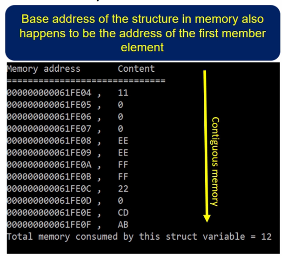

# Structures and pointers
- Creating pointer variables of structure
- Reading and writing data with member elements using structure pointers

Поля структури зберігаються в пам'яті послідовно одне за одним. Адреса структури збігається з адресою першого елемента структури.

## Приклад
```c
struct DataSet {
    char data1;
    int data2;
    char data3;
    short data4;
};

int main(void) {
    struct DataSet data;

    data.data1 = 0x11;
    data.data2 = 0xFFFFEEEE;
    data.data3 = 0x22;
    data.data4 = 0xABCD;
}
```


Тут можна побачить послідовність даних в пам'яті, спочатку йде 11, потім 0xFFFFEEEE, потім 22, а потім 0xABCD. 

# [чому в пам'яті ідуть цифри 11 0 0 0 .... Звідки ці нулі, якщо char займає тільки 1 байт](./memory%20alignment.md)

Дані в структурі можуть зберігатися не щільно, а з вирівнюванням. Це робиться для оптимізації доступу до пам'яті. Наприклад, якщо в структурі є int, то він повинен починатися з адреси кратної 4. Тому компілятор може вставити нулі між даними.

## using pointers with structures
```c
struct DataSet {
    char data1;
    int data2;
    char data3;
    short data4;
};

int main(void) {
    struct DataSet data;
    struct DataSet *pData = &data; // pointer to structure

    pData->data1 = 0x11; // using pointer to access structure members
    pData->data2 = 0xFFFFEEEE;
    pData->data3 = 0x22;
    pData->data4 = 0xABCD;

    uint8_t *ptr = (uint8_t *) &data; // pointer to first member of structure

    //modify the first element
    *ptr = 0x55;

    // modify the second element
    // Скільки ми маємо додати до вказівника, щоб перейти до другого елемента?
    
}
```

Нулі між даними (padding) заважає отримати доступ до даних в структурі. Визначати автоматично, на скільки треба перемістити `ptr` важко, тому краще використовувати `structure pointer` (вказівник на структуру). 
```c
// pData is a pointer variable of type struct DataSet*
struct DataSet *pData;

// pData now holds the address of structure variable data

// changing the value of data1 member element
pData->data1 = 0x55; // *(address_of_first_member_element_data1) = 0x55
```

