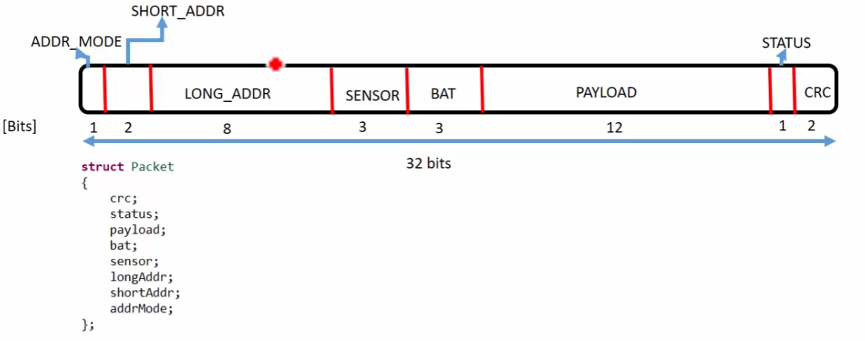

# Exercise
Write a program to decode a given 32bit packet information and print the values of different fields. Create a structure with member elements as packet fields as shown below.

packet information - це 32 бітний пакет, який несе певну інформацію, яка приймається на іншому кінці. Цей пакет може містити різну інформацію, таку як адреса відправника, адреса отримувача, тип даних, контрольна сума тощо.

  

Можна побачити, що для збереження полів, на яких треба 1, 2, 3 біти використовуються 8 бітні поля. Бо не буває типів даних менше ніж 8 біт (1 байт). Для збереження payload(12 біт) використовується 16 бітне поле. 

```c
#include <stdio.h>
#include <stdint.h>

struct Packet {
    uint8_t crc;
    uint8_t status;
    uint16_t payload;
    uint8_t bat;
    uint8_t sensor;
    uint8_t longAddr;
    uint8_t shortAddr;
    uint8_t addrMode;
};

int main(void) {
    uint32_t packetValue;
    printf("Enter the 32bit packet value: ");
    scanf("%x", &packetValue);
    struct Packet packet;

    packet.crc = uint8_t (packetValue & 0x3); // останні 2 біти
    packet.status = uint8_t ((packetValue >> 2) & 0x1); // наступний 1 біт, попередні 2 ігноруються за допомогою оператора bitwise right shift
    packet.payload = uint16_t ((packetValue >> 3) & 0xFFF); // наступні 12 біт, попередні 3 ігноруються
    packet.bat = uint8_t ((packetValue >> 15) & 0x7); // наступні 3 біти, попередні 15 ігноруються
    packet.sensor = uint8_t ((packetValue >> 18) & 0x7); // наступні 3 біти, попередні 18 ігноруються
    packet.longAddr = uint8_t ((packetValue >> 21) & 0xFF); // наступні 8 біт, попередні 21 ігноруються
    packet.shortAddr = uint8_t ((packetValue >> 29) & 0x3); // наступні 2 біти, попередні 29 ігноруються
    packet.addrMode = uint8_t ((packetValue >> 31) & 0x1); // останній біт, попередні 31 ігноруються

    printf("crc: %#x\n", packet.crc);
    printf("status: %#x\n", packet.status);
    printf("payload: %#x\n", packet.payload);
    printf("bat: %#x\n", packet.bat);
    printf("sensor: %#x\n", packet.sensor);
    printf("longAddr: %#x\n", packet.longAddr);
    printf("shortAddr: %#x\n", packet.shortAddr);
    printf("addrMode: %#x\n", packet.addrMode);
    
    printf("Size of struct is % I64u\n", sizeof(packet)); // виводить розмір структури в байтах. Виводить "10" байт
    // розмір пакета, який вводить користувач дорівнює 4 байти, тобто ми впусту витрачаємо 6 байт пам'яті.

}
```


