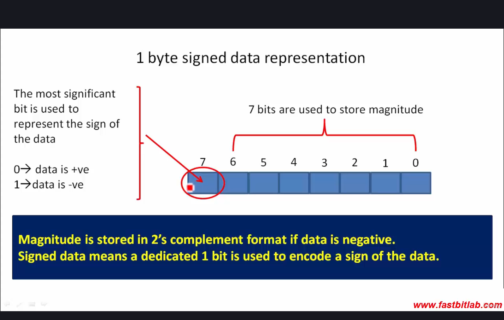
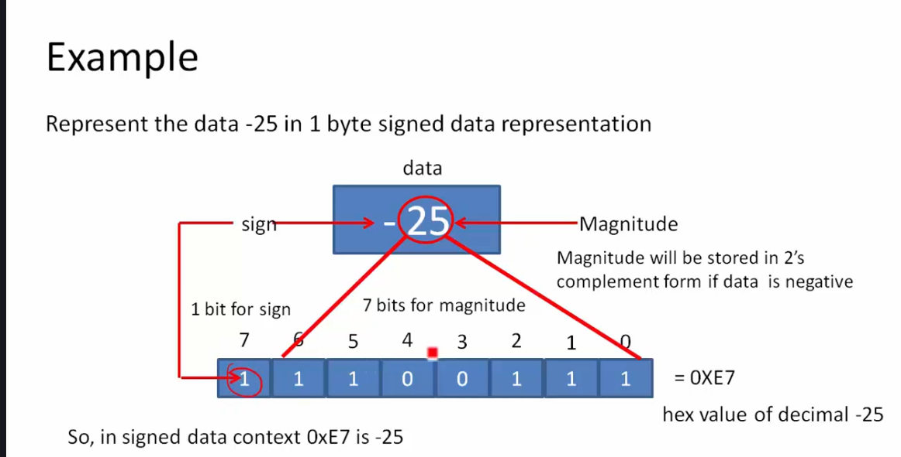

  

**[two's complement](https://www.youtube.com/watch?v=4qH4unVtJkE)**: негативне число представляється таким чином, щоб при додаванні його до позитивного числа, результат був 0. Наприклад:  
$0101 + 1011 = 10000$ або $5 + (-5) = 0$  
$1011$ - це two's complement для 5.  
Щоб інвертувати двійкове число в two's complement, треба інвертувати всі біти і додати 1.

## шістнадцятковий формат
Число $-25$ в двійковому форматі:  
1110 0111  
Ці дві частини можна представити в шістнадцятковому форматі:
1110 | 0111
--- | ---
E | 7

$-25 = 0xE7$.  
$0x$ - це префікс для шістнадцяткового числа.

## представлення в пам'яті
Якщо ми хочемо `signed` число, то ми резервуємо перший біт для знаку. 0 для позитивного числа, 1 для негативного.