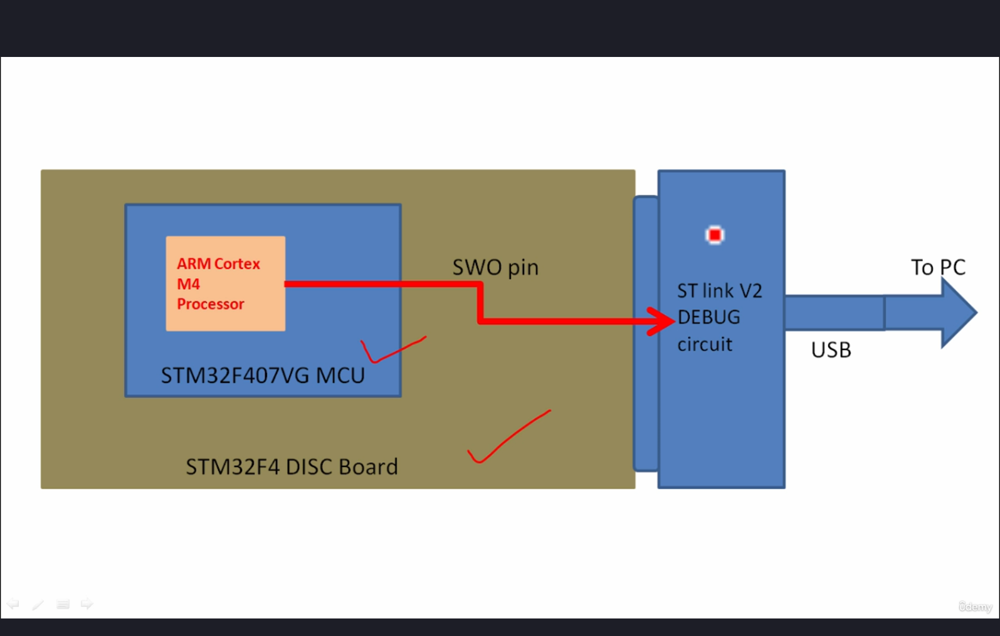
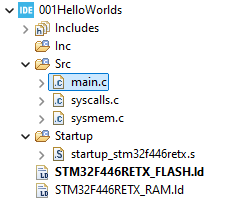

# Як можна виводити дані використовуючи `printf`, якщо це код для мікроконтролера?
- Цей метод підходить тільки для MCU(мікроконтролерів), які базуються на ARM Cortex M3/M4/M7 або вищих процесорах.  
- `printf` працює через SWO pin (Serial Wire Output) SWD інтерфейсу.

   
Структура плати:  
На платі **STM32F4 DISC Board** є мікроконтролер **STM32F407VG MCU**. Всередині мікроконтролера є **ARM Cortex-M4** процесор.

Процесор через **пін SWO** і через додаткову плату **ST link V2 DEBUG circuit** спілкується через USB з комп'ютером. Не на кожній платі ST є ця додаткова плата для підключення до комп'ютера.

SWO - це пін SWD. SWD - це Serial Wire Debug. Ця штука використовується для дебагу коду на мікроконтролері(додавання брейкпоінтів, виведення даних тощо, зупинка процесора і т.д.).

Всередині процесора є ITM unit (Instrumentation Trace Macrocell). 
.png>)  

Всередині ITM unit є буфер(FIFO), який містить всі дані з printf. З цього буфера дані потрапляють на комп'ютер через USB. 

## Для того, щоб функції printf записували дані в цей буфер, необхідно проводити додаткові кроки:  
Проєкт має наступну структуру:
    
Необхідно записати у файл `syscalls.c` наступний код після директив `#include`:
```c

/////////////////////////////////////////////////////////////////////////////////////////////////////////
//					Implementation of printf like feature using ARM Cortex M3/M4/ ITM functionality
//					This function will not work for ARM Cortex M0/M0+
//					If you are using Cortex M0, then you can use semihosting feature of openOCD
/////////////////////////////////////////////////////////////////////////////////////////////////////////


//Debug Exception and Monitor Control Register base address
#define DEMCR        			*((volatile uint32_t*) 0xE000EDFCU )

/* ITM register addresses */
#define ITM_STIMULUS_PORT0   	*((volatile uint32_t*) 0xE0000000 )
#define ITM_TRACE_EN          	*((volatile uint32_t*) 0xE0000E00 )

void ITM_SendChar(uint8_t ch)
{

	//Enable TRCENA
	DEMCR |= ( 1 << 24);

	//enable stimulus port 0
	ITM_TRACE_EN |= ( 1 << 0);

	// read FIFO status in bit [0]:
	while(!(ITM_STIMULUS_PORT0 & 1));

	//Write to ITM stimulus port0
	ITM_STIMULUS_PORT0 = ch;
}
```

Окрім того, необхідно наступним чином змінити функцію `_write` в цьому ж файлі:
```c
__attribute__((weak)) int _write(int file, char *ptr, int len)
{
  (void)file;
  int DataIdx;

  for (DataIdx = 0; DataIdx < len; DataIdx++)
  {
//    __io_putchar(*ptr++);
	  ITM_SendChar(*ptr++);
  }
  return len;
}
```

Після цього, ви можете використовувати `printf` для виведення даних на комп'ютер через USB.
```c
#include <stdio.h>
int main() {
    printf("Hello World\n");
    return 0;
}
```

Ми по суті підміняємо функцію, яку використовує `printf` під капотом.  
.png>)